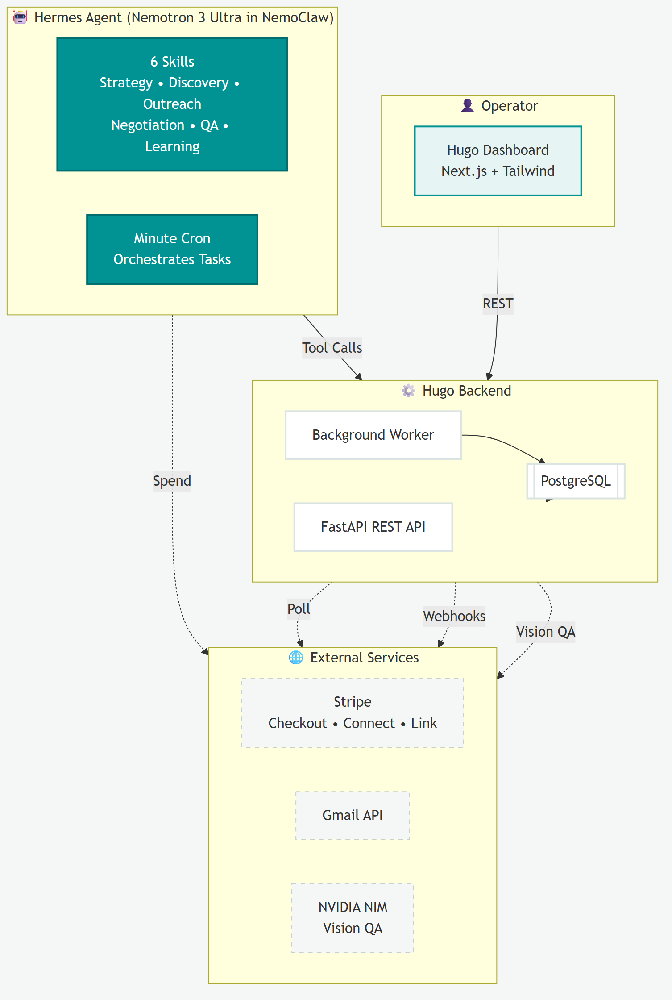
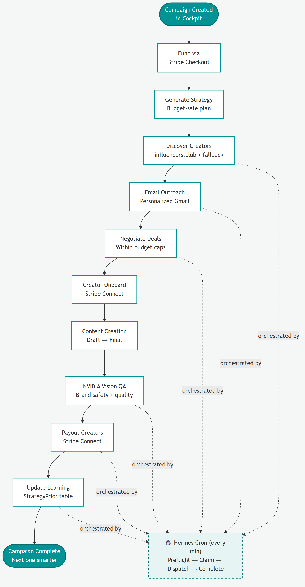
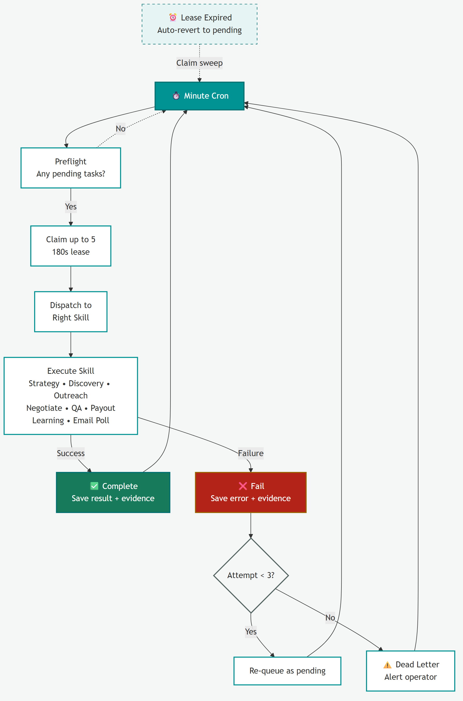
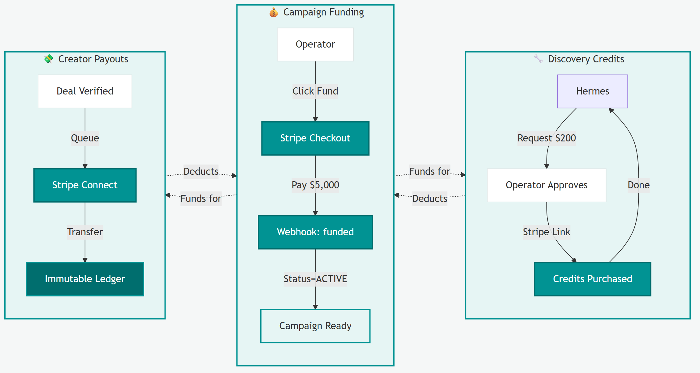
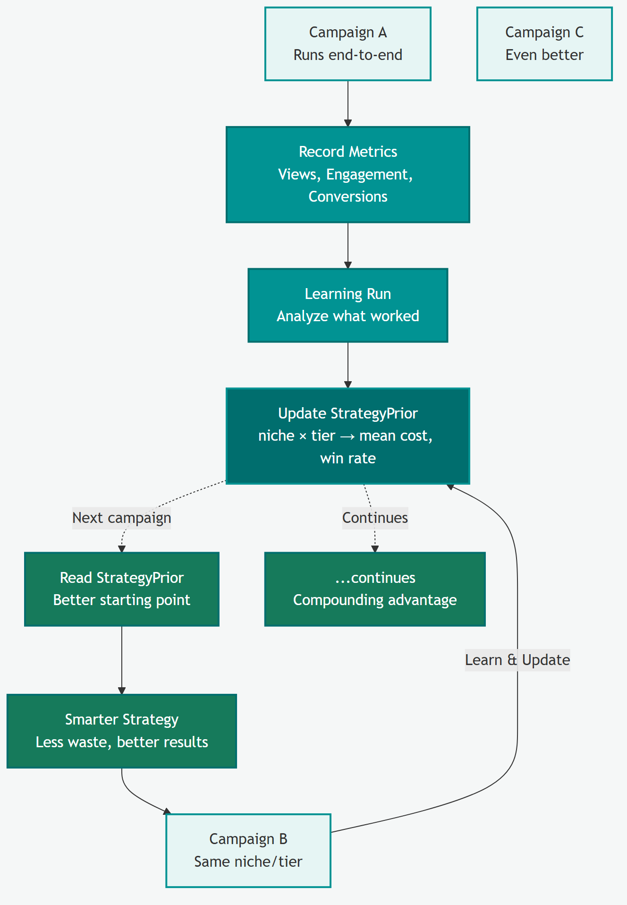
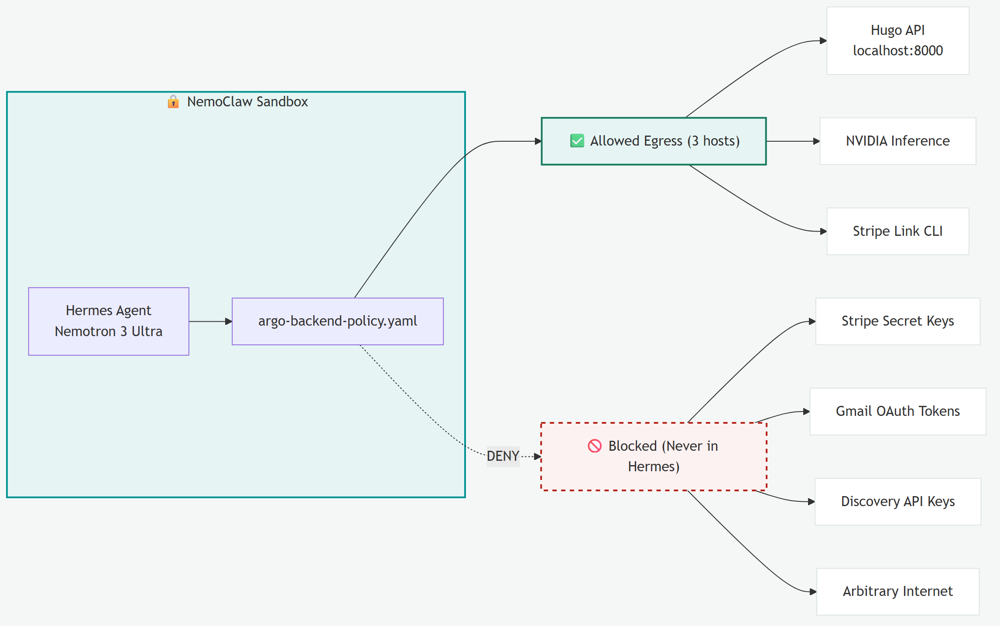

# Hugo

Autonomous creator-marketing operations built for the Hermes, NVIDIA, and Stripe hackathon.
Hugo uses live provider state: there is no demo mode, seeded workspace, or synthetic creator
fallback unless you explicitly enable demo data in the setup wizard.

## What Hugo does

Hugo is an operator dashboard and policy-enforced control plane for end-to-end influencer
campaigns. An operator defines a campaign; Hermes agents running in NVIDIA NemoClaw execute
strategy, discovery, outreach, QA, payouts, and learning while Hugo enforces budgets, state
transitions, and financial policy.

The system is designed around three autonomous capabilities:

**Agent earns** — Hermes sends approved fixed-price creator offers, records acceptance,
and closes contracts via email without human intervention.

**Agent spends** — The Stripe Link skill lets the agent purchase service credits (discovery
API) with operator approval gates. Stripe Checkout funds campaigns; Connect transfers pay
creators.

**Agent runs operations at scale** — A durable task queue with lease-based claiming lets
Hermes process strategy, discovery, outreach, QA, payouts, and learning across unlimited
campaigns. Each completed campaign improves future strategy through PostgreSQL priors.

**NemoClaw safety** — The agent sandbox enforces least-privilege egress. Hermes cannot
access Stripe keys, Gmail tokens, or arbitrary endpoints. Every financial action flows
through the policy-enforced FastAPI broker.

## How it works

### System architecture

Hermes agents run inside the NemoClaw sandbox and drive campaigns by calling the Hugo
backend. The operator interacts only with the Next.js dashboard; all external side effects
(Stripe, Gmail, NVIDIA) are brokered by the policy-enforced FastAPI control plane and its
background worker.



### Campaign lifecycle

An operator creates a campaign in the cockpit and funds it; from there Hermes runs the
entire lifecycle end to end. The minute cron orchestrates each autonomous step.



### Durable task queue

Every lifecycle step is a durable task. The minute cron claims pending tasks under a lease,
dispatches them to the right skill, and records results with evidence. Failures retry with
backoff and fall through to a dead-letter alert; expired leases auto-revert to pending so no
work is lost if a worker dies mid-task.



### Money flows

Three independent money paths are all brokered through Stripe. Operators fund campaigns via
Checkout; verified creator deals pay out through Connect into an immutable ledger; and Hermes
buys discovery credits through Stripe Link behind an operator-approval gate.



### Learning loop

Each completed campaign records its metrics and runs a learning pass that updates the
`StrategyPrior` table (keyed by niche × tier). The next campaign in the same niche/tier reads
those priors as a better starting point, so results compound over time.



### NemoClaw security

The NemoClaw network policy (`argo-backend-policy.yaml`) enforces least-privilege egress.
Hermes can only reach three hosts — the Hugo API, NVIDIA inference, and the Stripe Link CLI.
Stripe secret keys, Gmail OAuth tokens, discovery API keys, and the open internet are never
reachable from inside the agent sandbox.



## Tech stack

| Layer | Technology |
|---|---|
| Operator UI | Next.js 15, React 19, Tailwind CSS, TanStack Query |
| Control plane | FastAPI, SQLAlchemy, Alembic, PostgreSQL |
| Agent runtime | Hermes on NVIDIA NemoClaw with Nemotron 3 Ultra |
| Vision QA | NVIDIA NIM (Nemotron Nano vision) |
| Payments | Stripe Checkout, Connect, webhooks, Stripe Link |
| Email | Gmail OAuth API or Hermes-connected browser session |
| Deployment | Docker Compose (`postgres`, `api`, `worker`, `frontend`) |

## Prerequisites

- **Docker Desktop** (includes Docker Compose v2)
- **Hermes** with Nemotron 3 Ultra inside NemoClaw — see [nemo/README.md](nemo/README.md)
- **NVIDIA API key** with access to Nemotron 3 Ultra and the vision model
- **Stripe** account (test mode is fine) with Checkout, Connect, and webhook forwarding
- **Creator email** via Gmail OAuth (unattended) or a Hermes-connected Gmail/Outlook browser session
- **Stripe CLI** (recommended for local webhook forwarding)

Creator discovery is not configured in the wizard. Hermes owns discovery through the
`hugo-creator-discovery` skill: it tries influencers.club first, then falls back to web
research when that provider is unavailable. Hugo never copies discovery credentials into
its own application configuration.

## Setup

**Before cloning:** Hermes must ask the user where they want to install the system. Do not assume a
default directory — confirm the desired file path first.

Install Docker and ensure Docker Desktop is running, then:

```bash
cd <user-chosen-directory>
git clone https://github.com/Haaris-7/Hugo_AI.git
cd Hugo_AI
./setup.sh
```

If a previous install failed, run `./setup.sh --clean` first to wipe stale volumes.

The script creates local service tokens, starts PostgreSQL, the API, the autonomous worker, and
the Next.js dashboard, then opens [the setup wizard](http://localhost:3000/setup).

### Setup wizard

At [localhost:3000/setup](http://localhost:3000/setup), configure required integrations:

- Hermes running Nemotron 3 Ultra inside NemoClaw
- NVIDIA NIM vision
- Stripe Checkout, webhooks, and Connect
- Creator email through either Gmail OAuth (unattended) or a Hermes-connected,
  signed-in Gmail/Outlook browser session

Optional **demo data** seeds sample campaigns across lifecycle stages for exploration.
Disable it to remove seeded data. Live provider calls still require valid credentials.

After saving, click **Open dashboard** to enter the operator workspace.

See [nemo/README.md](nemo/README.md) for the full Hermes + NemoClaw setup guide.

## How to run

| Command | Purpose |
|---|---|
| `./setup.sh` | Build, start, and open setup |
| `./setup.sh --restart` | Rebuild and restart |
| `./setup.sh --stop` | Stop the stack |
| `./setup.sh --clean` | Stop and wipe database volumes |
| `make start` | Start without rebuilding |
| `make test` | Run backend tests |
| `make lint` | Run static checks |
| `scripts/dev.sh` | Local backend + frontend dev (after `scripts/bootstrap.sh`) |

The dashboard runs at [localhost:3000](http://localhost:3000), and the API reference is available at
[localhost:8000/docs](http://localhost:8000/docs).

## Autonomous operation

New campaigns default to full autonomy. After an operator creates a campaign, Hugo:

1. Generates and approves a policy-bounded strategy.
2. Creates the Stripe funding session and waits for the signed funding webhook.
3. Launches agent-managed creator discovery after funding settles.
4. Sends the complete deal by email and displays that exact message in the dashboard.
5. Polls Gmail on a recurring worker schedule, records fixed-offer responses, and stores email
   acceptance as the agreement.
6. Sends Stripe-hosted recipient onboarding and accepts draft/final links by email.
7. Runs NVIDIA QA, emails revision feedback, releases eligible payouts, measures results, and
   updates learning state.

When Hermes cron is active (`HUGO_HERMES_CRON_ACTIVE=true`), the Python worker handles
outbox jobs (learning, metrics, notifications) and email polling, while Hermes owns
lifecycle orchestration through the durable task queue.

There is intentionally no creator-side Hugo UI. Creator acceptance, submission, QA
feedback, and status updates stay in the email thread; Stripe's hosted onboarding remains external.

## Stripe webhook forwarding (development)

For local development, forward Stripe events to Hugo with the Stripe CLI:

1. Install the Stripe CLI: `brew install stripe/stripe-cli/stripe` (or see [Stripe docs](https://stripe.com/docs/stripe-cli))
2. Login: `stripe login`
3. Forward events to Hugo:
   ```bash
   stripe listen --forward-to localhost:8000/v1/webhooks/stripe
   ```
4. Copy the webhook signing secret (`whsec_...`) printed by the CLI into your `.env`:
   ```
   HUGO_STRIPE_WEBHOOK_SECRET=whsec_...
   ```
5. Restart the API after updating `.env`, or save the secret through the setup wizard.
6. Trigger a test event in another terminal:
   ```bash
   stripe trigger checkout.session.completed
   ```

Offline tests mock `stripe.Webhook.construct_event` intentionally. Production and Docker
deployments use real signature verification with your configured webhook secret.

## Project structure

```
.
├── backend/hugo/          # FastAPI control plane, worker, domain logic
├── frontend/              # Next.js operator dashboard
│   └── app/
│       ├── (dashboard)/   # Overview, campaigns, finance, learning, system
│       └── setup/         # First-run integration wizard
├── hermes-plugin/hugo-ops/  # Policy-enforced Hermes tools
├── hermes-skills/         # Hermes skill definitions (strategy, discovery, cron, …)
├── nemo/                  # NemoClaw network policy and Hermes setup guide
├── alembic/               # Database migrations
├── docker-compose.yml     # Postgres, API, worker, frontend
└── setup.sh               # One-command bootstrap
```

## Hermes integration

Hugo exposes lifecycle tools through the `hugo-ops` Hermes plugin. Agents call the FastAPI
broker; the broker enforces campaign state, budgets, and idempotency before touching Stripe,
Gmail, or NVIDIA.

Key skills (install into the Hermes sandbox — see [nemo/README.md](nemo/README.md)):

| Skill | Purpose |
|---|---|
| `hugo-strategy-engine` | Budget-safe campaign strategy |
| `hugo-creator-discovery` | Creator discovery (influencers.club + research fallback) |
| `hugo-outreach` | Fixed-offer email outreach and creator responses |
| `hugo-browser-email` | Gmail/Outlook delivery through a connected browser session |
| `hugo-performance-learning` | Post-campaign learning |
| `hugo-cron-orchestration` | Minute cron loop for durable tasks |
| `hugo-platform-intelligence` | Platform playbook research |

Partner skills: `official/payments/stripe-link-cli` and NVIDIA NemoClaw skills.

The **System** page in the dashboard shows service health, Hermes task queue status, and
live probes for Nemotron round-trips.
